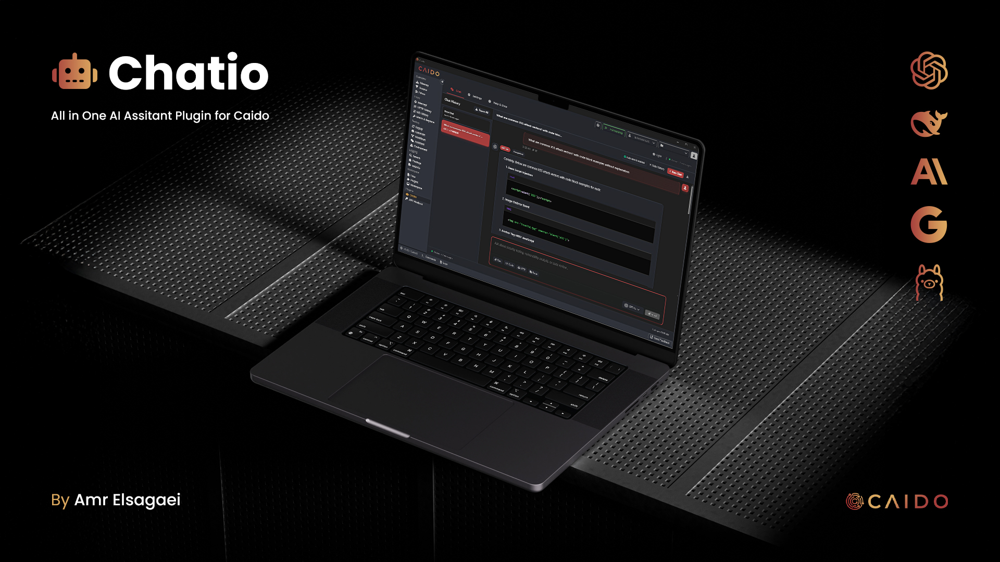

<div align="left">
  

  <p>  <br>
    <strong>An AI-powered assistant for hackers and security professionals built for Caido</strong>
  </p>
  <br>
</div>

---

<details closed>
<summary><b>Table of Contents</b></summary>
<br>

- [Overview](#overview)
- [Features](#features)
- [Installation](#installation)
- [Quick Start](#quick-start)
- [AI Provider Setup](#ai-provider-setup)
- [Usage](#usage)
- [Security Testing Workflows](#security-testing-workflows)
- [Advanced Features](#advanced-features)
- [Troubleshooting](#troubleshooting)
- [Documentation](#documentation)
- [Updates](#updates)
- [Feedback & Issues](#feedback--issues)
- [License](#license)
</details>

## Overview

Chatio is a comprehensive AI-powered security testing assistant that seamlessly integrates with Caido. Designed specifically for penetration testers, security researchers, and cybersecurity professionals, Chatio provides intelligent analysis, vulnerability assessment, and expert guidance across all aspects of security testing.

With support for multiple AI providers and specialized security-focused capabilities, Chatio transforms your Caido workflow into an intelligent security testing environment.

## Features

<details>
<summary><b>Multi-Provider AI Support</b></summary>
<br>

- **OpenAI Integration:** GPT-4o, GPT-4-turbo, and GPT-3.5 models with vision capabilities
- **Anthropic Claude:** Claude 3.5 Sonnet, Claude 3 Haiku for advanced code analysis
- **Google Gemini:** Free tier available with Gemini Pro and Flash models
- **DeepSeek:** Cost-effective alternative with competitive performance
- **Local LLMs:** Complete privacy with Ollama integration (llama3.2, mistral, codellama)
- **Dynamic Model Switching:** Choose the best AI model for each specific task
</details>

<details>
<summary><b>Advanced File & Image Analysis</b></summary>
<br>

- **Vision-Powered Analysis:** Upload screenshots, network diagrams, and visual evidence
- **Code File Processing:** Direct analysis of source code files (.py, .js, .php, .java, etc.)
- **Multi-Format Support:** JSON, XML, HTML, text files, and configuration files
- **Drag & Drop Interface:** Simple file attachment with visual preview
- **Batch Processing:** Analyze multiple files simultaneously
- **Smart Content Recognition:** Automatic handling of different file types
</details>

<details>
<summary><b>Intelligent Chat System</b></summary>
<br>

- **Context-Aware Conversations:** Maintains testing context across multiple exchanges
- **Chat History Management:** Persistent conversation storage with search capabilities
- **Quick Prompt Templates:** Pre-built templates for common security scenarios
- **Export Capabilities:** Save conversations and findings for reporting
- **Multi-Chat Support:** Organize different testing sessions separately
- **Real-time Status:** Live connection status and provider information
</details>

<details>
<summary><b>Professional Security Features</b></summary>
<br>

- **Custom System Prompts:** Tailor AI behavior for specific testing methodologies
- **Tool Integration Guidance:** Expert advice on Burp Suite, Metasploit, Nmap usage
- **Attack Vector Libraries:** Comprehensive payload databases and exploitation techniques
- **Reconnaissance & OSINT:** Information gathering and target profiling strategies
- **Compliance & Reporting:** Structured output for professional security assessments
- **Automation Scripts:** Generate custom testing scripts and workflows
</details>

<details>
<summary><b>Privacy & Security</b></summary>
<br>

- **Local Storage:** All data stored locally in your local storage
- **API Key Security:** Encrypted storage of sensitive credentials
- **No Data Logging:** Conversations remain private and are not transmitted to third parties
- **Offline Capability:** Full functionality with local LLM providers
- **Secure Configuration:** Best practices for API key management and usage limits
</details>

## Installation

1. Open Caido
2. Navigate to **Settings > Plugins** 
3. Click the **Plugin Store** tab
4. Search for "Chatio"
5. Click **Install**

## Quick Start

### First-Time Setup

1. **Configure Your First AI Provider:**
   - For beginners: Start with Google Gemini (free tier) or Local LLMs
   - For professionals: OpenAI GPT-4o or Claude 3.5 Sonnet
   - Navigate to Settings tab and add your API key

2. **Test Your Connection:**
   - Click "Test Connection" for your chosen provider
   - Verify successful authentication

3. **Start Your First Analysis:**
   - Switch to Chat tab
   - Upload a code file or describe your testing scenario
   - Ask specific security-related questions

4. **Explore Advanced Features:**
   - Try file uploads for code review
   - Upload screenshots for visual analysis
   - Use quick prompt templates for common scenarios

## AI Provider Setup

<div align="left">
  
| Provider | Setup Steps | Cost | Best For |
|----------|-------------|------|----------|
| **Google Gemini** | Visit [aistudio.google.com](https://aistudio.google.com) → API Keys → Create | Free tier available | Beginners, general testing |
| **OpenAI** | Visit [platform.openai.com](https://platform.openai.com) → API Keys → Create | ~$0.03/1K tokens (GPT-4) | Professional testing, vision |
| **Anthropic** | Visit [console.anthropic.com](https://console.anthropic.com) → API Keys → Create | ~$0.025/1K tokens | Code analysis, complex reasoning |
| **Local LLMs** | Install Ollama → `ollama pull llama3.2` | Free | Privacy, offline testing |
| **DeepSeek** | Visit [platform.deepseek.com](https://platform.deepseek.com) → API Keys → Create | Cost-effective | Budget-conscious professionals |

</div>

### Recommended Models by Use Case

<div align="left">

| Use Case | Recommended Model | Provider |
|----------|------------------|----------|
| **Code Security Review** | Claude 3.5 Sonnet | Anthropic |
| **Image Analysis** | GPT-4o | OpenAI |
| **General Security Questions** | Gemini Pro | Google |
| **Complex Exploitation** | GPT-4-turbo | OpenAI |
| **Privacy-Focused Testing** | llama3.2, mistral | Local (Ollama) |
| **Rapid Prototyping** | GPT-3.5-turbo | OpenAI |

</div>

## Usage

### Basic Security Analysis

1. **Ask Security Questions:**
   ```
   "Explain SQL injection techniques for MySQL databases"
   "How to bypass WAF protection in XSS attacks"
   "Generate a phishing email template for IT security testing"
   ```

2. **Upload Code for Review:**
   - Drag & drop source code files
   - Get instant security vulnerability analysis
   - Receive specific fix recommendations

3. **Visual Evidence Analysis:**
   - Upload screenshots of applications
   - Analyze network topology diagrams
   - Get insights from error messages or logs

### Advanced Security Testing

1. **Structured Penetration Testing:**
   - Use quick prompt templates for different phases
   - Maintain context across reconnaissance to post-exploitation
   - Generate detailed methodology documentation

2. **Multi-File Analysis:**
   - Upload entire codebases for comprehensive review
   - Analyze configuration files for misconfigurations
   - Process log files for security incidents

3. **Custom Testing Scenarios:**
   - Set specialized system prompts for specific environments
   - Integrate with Caido's intercept and modification features
   - Generate custom payloads and test cases

## Security Testing Workflows

### Professional Testing Methodologies

1. **Reconnaissance Phase:**
   - OSINT gathering strategies
   - Target profiling techniques
   - Attack surface enumeration

2. **Vulnerability Assessment:**
   - Automated scan result analysis
   - Manual testing guidance
   - False positive filtering

3. **Exploitation Development:**
   - Custom payload creation
   - Bypass technique development
   - Proof-of-concept scripting

4. **Post-Exploitation:**
   - Lateral movement strategies
   - Persistence mechanisms
   - Data exfiltration techniques

5. **Reporting & Documentation:**
   - Structured finding reports
   - Executive summary generation
   - Remediation recommendations

## Advanced Features

### Context Management
- **Intelligent Memory:** Maintains conversation context across multiple exchanges
- **Session Organization:** Separate chats for different testing phases
- **Context Optimization:** Configurable message history for optimal performance

### Custom System Prompts
```
Example: "You are a penetration testing expert specializing in web applications. 
Focus on practical exploitation techniques and provide step-by-step methodologies."
```

### File Processing Capabilities
- **Supported Formats:** Images (PNG, JPG), Code files (.py, .js, .php, etc.), Documents (TXT, JSON, XML)
- **Vision Models:** Automatic detection and use of image-capable models
- **Batch Analysis:** Process multiple files simultaneously

### Integration Features
- **Caido Workflow:** Seamless integration with Caido's proxy and testing features
- **Export Functions:** Save conversations, findings, and methodologies
- **Theme Support:** Dark/light mode matching Caido's interface

## Troubleshooting

### Common Issues

<details>
<summary><b>API Key & Authentication Problems</b></summary>
<br>

- **Invalid API Key:** Verify key format and check for extra spaces
- **Insufficient Quota:** Add payment method in provider dashboard
- **Rate Limiting:** Switch to different model or wait for reset
- **Network Issues:** Check firewall/proxy settings, try different networks
</details>

<details>
<summary><b>File Upload & Image Analysis</b></summary>
<br>

- **Image Analysis Failing:** Ensure vision-capable model is selected
- **File Size Limits:** Reduce file size or split large files
- **Unsupported Formats:** Check supported file types in documentation
- **Upload Errors:** Try copy-paste for text content
</details>

<details>
<summary><b>Performance Optimization</b></summary>
<br>

- **Slow Responses:** Reduce context messages, use faster models
- **High Costs:** Monitor usage, set limits, use cheaper models for simple queries
- **Connection Issues:** Verify internet stability, restart Caido if needed
</details>

### Local LLM Setup

1. **Install Ollama:**
   ```bash
   # Download from https://ollama.ai
   ollama serve
   ```

2. **Download Models:**
   ```bash
   ollama pull llama3.2          # General purpose
   ollama pull llama3.2-vision   # Image analysis
   ollama pull codellama         # Code analysis
   ```

3. **Configure Chatio:**
   - Set URL: `http://localhost:11434`
   - Add models: `llama3.2, llama3.2-vision, codellama`

## Documentation

Complete documentation including:
- **Setup Guides:** Step-by-step provider configuration
- **Security Templates:** Pre-built prompts for common scenarios
- **Best Practices:** Professional testing methodologies
- **Troubleshooting:** Comprehensive problem-solving guides

Access the full documentation within the plugin under the **Help & Docs** tab.

## Updates

Chatio is actively maintained with regular updates including:
- New AI provider integrations
- Enhanced security testing templates
- Performance optimizations

## Feedback & Issues

If you encounter any issues or have suggestions for improvements, please:
- Report bugs and feature requests
- Share your security testing workflows
- Contribute to the growing knowledge base

## License

This project is licensed under the MIT License - see the [LICENSE](LICENSE) file for details.

---

<div align="center">
  <p>Made with ❤️ by <a href="https://amrelsagaei.com">Amr Elsagaei</a> for the Caido and security community</p>
</div> 
